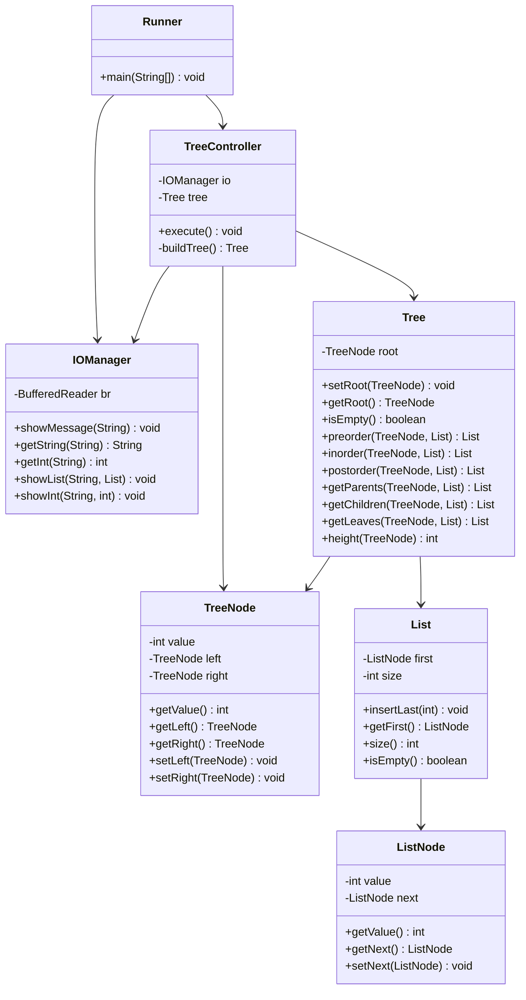

# ArbolesBinarios

Implements a binary tree with preorder/inorder/postorder traversals and queries for parent, child, and leaf nodes, using MVC architecture and a custom linked list structure.

## Exercise

Given the binary tree in list notation:

```
24 ( 27 ( 32 , 4 ( 3 , 6 ) ), 5 ( 12 , 1 ( 8 ( null , 2 ), null ) ) )
```

The program displays:

1. The tree content in preorder, inorder, and postorder
2. How many and which nodes are **parent** nodes (have at least one child)
3. How many and which nodes are **child** nodes (have a parent)
4. How many and which nodes are **leaf** nodes (have no children)
5. The **height** of the tree

All tree operations are implemented as methods in the `Tree` class that receive a `List` and return it filled with results — following the professor's TAD design directly.

## Architectural Note

`buildTree()` lives in `TreeController`, not in `Tree`. This follows the professor's TAD (page 8), where tree construction is shown inside the `Control` class.

The reasoning: the `Tree` model only defines the structure and the algorithms. The controller decides *what data* to load into it. This respects the Single Responsibility Principle — the model is reusable with any tree, and the controller owns the domain-specific initialization.

## Class Diagram



## Structure

```
ArbolesBinarios/
├── src/
│   └── arbolesbinarios/
│       ├── runner/
│       │   └── Runner.java         # Entry point — wires IOManager → TreeController
│       ├── view/
│       │   └── IOManager.java      # All console I/O (BufferedReader + System.out)
│       ├── controller/
│       │   └── TreeController.java # Builds the tree, calls operations, delegates to view
│       └── model/
│           ├── Tree.java           # Binary tree operations (return List, no I/O)
│           ├── TreeNode.java       # Binary tree node (value, left, right)
│           ├── List.java           # Custom singly-linked list (not java.util.List)
│           └── ListNode.java       # Linked list cell (value, next)
├── bin/                            # Compiled .class files (git-ignored)
└── README.md
```

## How to Run

```bash
cd ArbolesBinarios
mkdir -p bin
javac -d bin $(find src -name "*.java")
java -cp bin arbolesbinarios.runner.Runner
```

Expected output:

```
Presione ENTER para iniciar...

=== ÁRBOL BINARIO ===
Árbol: 24(27(32, 4(3,6)), 5(12, 1(8(null,2), null)))

--- Recorridos ---
Preorden:   24, 27, 32, 4, 3, 6, 5, 12, 1, 8, 2  (11 nodos)
Inorden:    32, 27, 3, 4, 6, 24, 12, 5, 8, 2, 1  (11 nodos)
Postorden:  32, 3, 6, 4, 27, 12, 2, 8, 1, 5, 24  (11 nodos)

--- Nodos padre ---
Padres: 24, 27, 4, 5, 1, 8  (6 nodos)

--- Nodos hijo ---
Hijos: 27, 5, 32, 4, 3, 6, 12, 1, 8, 2  (10 nodos)

--- Nodos hoja ---
Hojas: 32, 3, 6, 12, 2  (5 nodos)

--- Altura del árbol ---
Altura: 5
```
