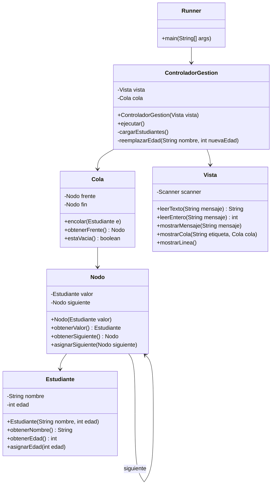

# GestionEstudiantes - Queue Student Management

A student queue management application in Java that demonstrates MVC architecture and a custom queue data structure. Given a queue of students (name and age), searches for a specific student by name and replaces their age, then displays the original queue and the updated queue.

## Exercise

**Reemplazar Edad** - Reads student name/age pairs into a queue (type `end` to finish), then asks for a name and a new age. Traverses the queue non-destructively to find the matching student and updates their age in place. Displays the original queue before the update and the resulting queue after.

> **Comportamiento con nombres duplicados:** si la cola contiene más de un estudiante con el mismo nombre, solo se actualiza la edad del primero que se encuentre (el más cercano al frente). Los demás estudiantes con ese nombre no se modifican.

## Class Diagram



## Structure

```
GestionEstudiantes/
├── src/
│   └── gestionestudiantes/
│       ├── controlador/
│       │   └── ControladorGestion.java   # Flujo principal del ejercicio
│       ├── modelo/
│       │   ├── Estudiante.java           # Dominio: nombre y edad
│       │   ├── Nodo.java                 # Nodo de la cola (almacena Estudiante)
│       │   └── Cola.java                 # Cola enlazada FIFO
│       ├── runner/
│       │   └── Runner.java               # Punto de entrada
│       └── vista/
│           └── Vista.java                # Entrada/salida con el usuario
└── README.md
```

## How to Run

```bash
# Navigate to the project directory
cd /path/to/GestionEstudiantes

# Compile the project
javac -d bin $(find src -name "*.java")

# Run the project
java -cp bin gestionestudiantes.runner.Runner
```
