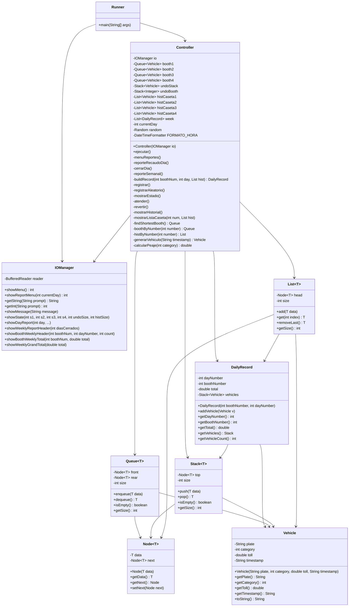

# PeajeInteligente - Sistema de Peaje Inteligente

Sistema de gestion de peaje en Java con arquitectura MVC y estructuras de datos personalizadas. Administra cuatro casetas de cobro mediante colas FIFO, asignando cada vehiculo a la caseta con menos carga. Permite revertir la ultima atencion con una pila, consultar el historial por caseta con listas, y generar reportes diarios y semanales mediante registros diarios por caseta.

## Exercise

**Peaje Inteligente** - Registra vehiculos (placa, categoria, hora) de forma manual o automatica y los distribuye a la caseta con menos vehiculos en espera. La atencion desencola todos los vehiculos de la caseta seleccionada en orden FIFO, guardando cada uno en una pila de deshacer y en el historial de su caseta. Revertir extrae el ultimo vehiculo de la pila y lo elimina del historial. Al cerrar el dia se genera un arqueo de caja por caseta (DailyRecord) y el sistema queda vacio para el siguiente dia. Cada siete dias el supervisor consulta el historico semanal por caseta en orden LIFO (ultimo vehiculo primero), con total por dia y total general de la semana.

## Class Diagram



## Structure

```
PeajeInteligente/
├── src/
│   └── peajeinteligente/
│       ├── runner/
│       │   └── Runner.java           # Punto de entrada
│       ├── controller/
│       │   └── Controller.java       # Logica de negocio, menu y reportes
│       ├── view/
│       │   └── IOManager.java        # Entrada/salida con BufferedReader
│       └── model/
│           ├── Vehicle.java          # Dominio: placa, categoria, peaje, timestamp
│           ├── DailyRecord.java      # Registro diario por caseta con pila LIFO
│           ├── Node.java             # Nodo generico enlazado
│           ├── Queue.java            # Cola FIFO enlazada con contador de tamano
│           ├── Stack.java            # Pila LIFO enlazada con contador de tamano
│           └── List.java             # Lista enlazada simple con acceso por indice
├── bin/
└── README.md
```

## How to Run

```bash
cd PeajeInteligente

~/.sdkman/candidates/java/current/bin/javac -d bin $(find src -name "*.java")

~/.sdkman/candidates/java/current/bin/java -cp bin peajeinteligente.runner.Runner
```
