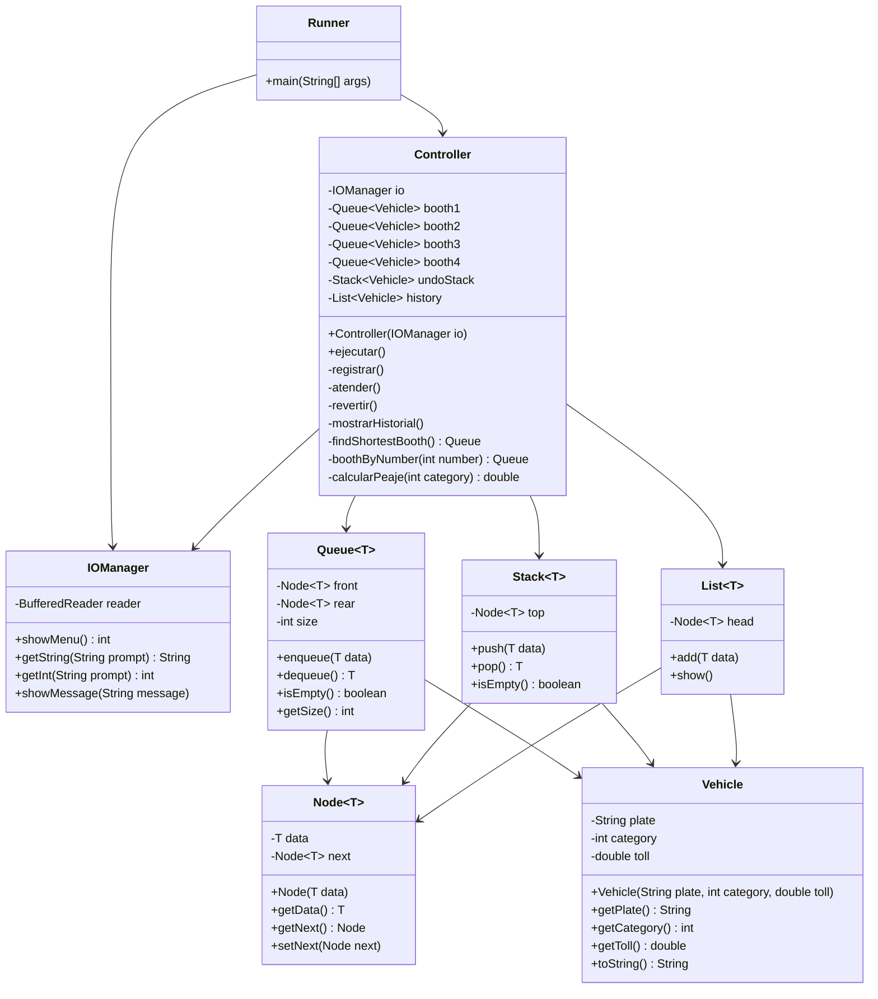

# PeajeInteligente - Sistema de Peaje Inteligente

Sistema de gestion de peaje en Java que aplica arquitectura MVC y estructuras de datos personalizadas. Administra cuatro casetas de cobro mediante colas enlazadas, asignando cada vehiculo a la caseta con menos carga. Permite revertir la ultima atencion con una pila y consultar el historial cronologico con una lista.

## Exercise

**Peaje Inteligente** - Registra vehiculos (placa y categoria) y los distribuye automaticamente a la caseta con menos vehiculos en espera. La atencion desencola al primer vehiculo de la caseta seleccionada, lo guarda en una pila de deshacer y en el historial. La opcion de revertir extrae el ultimo vehiculo de la pila. El historial muestra todos los vehiculos atendidos en orden cronologico.

## Class Diagram



## Structure

```
PeajeInteligente/
├── src/
│   └── peajeinteligente/
│       ├── runner/
│       │   └── Runner.java           # Punto de entrada
│       ├── controller/
│       │   └── Controller.java       # Logica de negocio y menu principal
│       ├── view/
│       │   └── IOManager.java        # Entrada/salida con BufferedReader
│       └── model/
│           ├── Vehicle.java          # Dominio: placa, categoria, peaje
│           ├── Node.java             # Nodo generico enlazado
│           ├── Queue.java            # Cola FIFO enlazada con contador de tamano
│           ├── Stack.java            # Pila LIFO enlazada
│           └── List.java             # Lista enlazada simple
├── bin/
└── README.md
```

## How to Run

```bash
# Navigate to the project directory
cd PeajeInteligente

# Compile the project
~/.sdkman/candidates/java/current/bin/javac -d bin $(find src -name "*.java")

# Run the project
~/.sdkman/candidates/java/current/bin/java -cp bin peajeinteligente.runner.Runner
```
