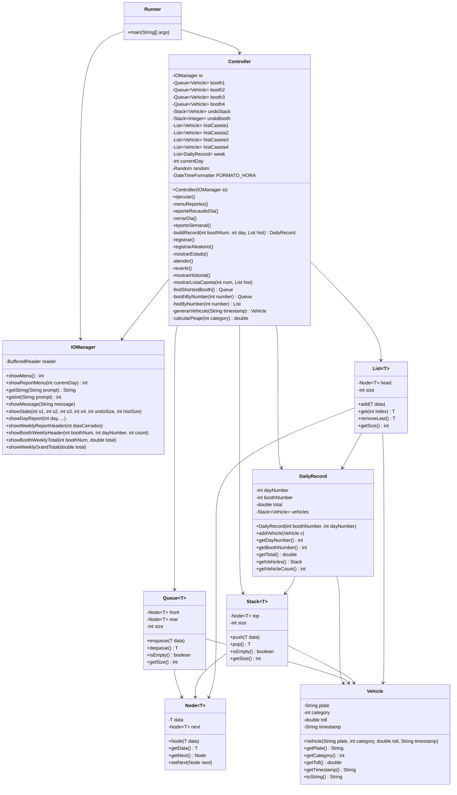

# PeajeInteligente — Intelligent Toll Booth System

Java MVC application with custom data structures that manages four toll booths using FIFO queues, automatically assigning each incoming vehicle to the booth with the shortest queue. Supports undo of the last attended vehicle via a stack, per-booth daily history via linked lists, and daily and weekly revenue reports via per-booth daily records.

## Exercise

**Peaje Inteligente** — Vehicles (plate, category, arrival time) are registered manually or in bulk and distributed to the shortest booth. Attending a booth dequeues all its vehicles in FIFO order, pushing each onto an undo stack and appending it to that booth's daily history list. Reverting pops the last vehicle from the undo stack and removes it from the corresponding history. Closing the day produces a per-booth cash reconciliation (`DailyRecord`) and resets all structures for the next day. After seven days the supervisor reviews the weekly report per booth in LIFO order (most recent vehicle first), with a per-day total and a weekly grand total.

## Class Diagram


```mermaid
classDiagram
    class Runner {
        +main(String[] args)
    }
    class Controller {
        -IOManager io
        -Queue~Vehicle~ booth1
        -Queue~Vehicle~ booth2
        -Queue~Vehicle~ booth3
        -Queue~Vehicle~ booth4
        -Stack~Vehicle~ undoStack
        -Stack~Integer~ undoBooth
        -List~Vehicle~ histCaseta1
        -List~Vehicle~ histCaseta2
        -List~Vehicle~ histCaseta3
        -List~Vehicle~ histCaseta4
        -List~DailyRecord~ week
        -int currentDay
        -Random random
        -DateTimeFormatter FORMATO_HORA
        +Controller(IOManager io)
        +ejecutar()
        -menuReportes()
        -reporteRecaudoDia()
        -cerrarDia()
        -reporteSemanal()
        -buildRecord(int boothNum, int day, List hist) DailyRecord
        -registrar()
        -registrarAleatorio()
        -mostrarEstado()
        -atender()
        -revertir()
        -mostrarHistorial()
        -mostrarListaCaseta(int num, List hist)
        -findShortestBooth() Queue
        -boothByNumber(int number) Queue
        -histByNumber(int number) List
        -generarVehiculo(String timestamp) Vehicle
        -calcularPeaje(int category) double
    }
    class IOManager {
        -BufferedReader reader
        +showMenu() int
        +showReportMenu(int currentDay) int
        +getString(String prompt) String
        +getInt(String prompt) int
        +showMessage(String message)
        +showState(int s1, int s2, int s3, int s4, int undoSize, int histSize)
        +showDayReport(int day, ...)
        +showWeeklyReportHeader(int diasCerrados)
        +showBoothWeeklyHeader(int boothNum, int dayNumber, int count)
        +showBoothWeeklyTotal(int boothNum, double total)
        +showWeeklyGrandTotal(double total)
    }
    class DailyRecord {
        -int dayNumber
        -int boothNumber
        -double total
        -Stack~Vehicle~ vehicles
        +DailyRecord(int boothNumber, int dayNumber)
        +addVehicle(Vehicle v)
        +getDayNumber() int
        +getBoothNumber() int
        +getTotal() double
        +getVehicles() Stack
        +getVehicleCount() int
    }
    class Vehicle {
        -String plate
        -int category
        -double toll
        -String timestamp
        +Vehicle(String plate, int category, double toll, String timestamp)
        +getPlate() String
        +getCategory() int
        +getToll() double
        +getTimestamp() String
        +toString() String
    }
    class Queue~T~ {
        -Node~T~ front
        -Node~T~ rear
        -int size
        +enqueue(T data)
        +dequeue() T
        +isEmpty() boolean
        +getSize() int
    }
    class Stack~T~ {
        -Node~T~ top
        -int size
        +push(T data)
        +pop() T
        +isEmpty() boolean
        +getSize() int
    }
    class List~T~ {
        -Node~T~ head
        -int size
        +add(T data)
        +get(int index) T
        +removeLast() T
        +getSize() int
    }
    class Node~T~ {
        -T data
        -Node~T~ next
        +Node(T data)
        +getData() T
        +getNext() Node
        +setNext(Node next)
    }

    Runner --> Controller
    Runner --> IOManager
    Controller --> IOManager
    Controller --> Queue
    Controller --> Stack
    Controller --> List
    Controller --> DailyRecord
    DailyRecord --> Stack
    DailyRecord --> Vehicle
    Queue --> Node
    Stack --> Node
    List --> Node
    Queue --> Vehicle
    Stack --> Vehicle
    List --> Vehicle
    List --> DailyRecord
```

## Structure

```
PeajeInteligente/
├── src/
│   └── peajeinteligente/
│       ├── runner/
│       │   └── Runner.java           # Entry point
│       ├── controller/
│       │   └── Controller.java       # Business logic, menu dispatch, reports
│       ├── view/
│       │   └── IOManager.java        # I/O via BufferedReader
│       └── model/
│           ├── Vehicle.java          # Domain: plate, category, toll, timestamp
│           ├── DailyRecord.java      # Per-booth daily record with LIFO vehicle stack
│           ├── Node.java             # Generic linked node
│           ├── Queue.java            # FIFO linked queue with size counter
│           ├── Stack.java            # LIFO linked stack with size counter
│           └── List.java             # Singly linked list with index access
├── bin/
└── README.md
```

## Possible improvements

A natural improvement would be to encapsulate each toll booth in a `Booth` class that internally groups its waiting queue (`Queue<Vehicle>`), its daily history (`List<Vehicle>`), and its undo stack (`Stack<Vehicle>`). With that design, reverting would operate on the specific booth rather than a shared global stack, which better reflects reality: a registration error happens at a particular booth. The `Controller` would go from managing eight separate structures to holding four `Booth` objects, simplifying `atender()`, `revertir()`, `reporteRecaudoDia()`, and `cerrarDia()`.

A second improvement relates to `IOManager.showDayReport()`, which currently receives thirteen individual parameters. Wrapping those values in a `DayReport` data class would make the method signature readable and easy to extend (e.g., adding per-category averages later) without touching the Controller or the IOManager signature again.

A third improvement concerns the `Vehicle` model: a vehicle should not store the toll amount, since the toll depends on the specific toll booth it passes through, not on the vehicle itself. The vehicle only knows its category; the fare calculation belongs in the `Controller` or in a separate pricing service. This would make `Vehicle` a purer domain object and allow different toll booths to apply different rates without modifying the model.

## How to Run

```bash
# Navigate to the project directory
cd /path/to/PeajeInteligente

# Compile the project
javac -d bin $(find src -name "*.java")

# Run the project
java -cp bin peajeinteligente.runner.Runner
```
