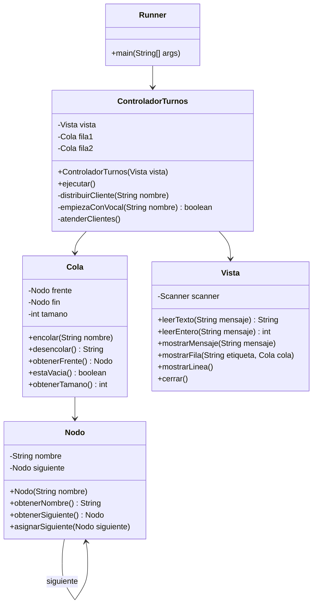

# TurnosBanco - Bank Queue Management

A bank client queue application in Java that demonstrates MVC architecture and custom queue data structures. Distributes clients into two queues based on the first letter of their name (vowel → queue 1, consonant → queue 2), then serves them in order, alternating between queues with priority given to queue 1.

## Exercise

**Turnos** - Reads the number of clients and their names. Each client is assigned to a queue based on whether their name starts with a vowel (fila 1 — priority) or a consonant (fila 2). Both queues are displayed, then clients are served one at a time alternating fila1/fila2, with priority always to fila1. When a queue empties, it is reported as "no hay".

## Class Diagram



## Structure

```
TurnosBanco/
├── src/
│   └── turnosbanco/
│       ├── controlador/
│       │   └── ControladorTurnos.java    # Flujo principal del ejercicio
│       ├── modelo/
│       │   ├── Nodo.java                 # Nodo de la cola (almacena nombre)
│       │   └── Cola.java                 # Cola enlazada FIFO
│       ├── runner/
│       │   └── Runner.java               # Punto de entrada
│       └── vista/
│           └── Vista.java                # Entrada/salida con el usuario
└── README.md
```

## How to Run

```bash
# Navigate to the project directory
cd /path/to/TurnosBanco

# Compile the project
javac -d bin $(find src -name "*.java")

# Run the project
java -cp bin turnosbanco.runner.Runner
```
